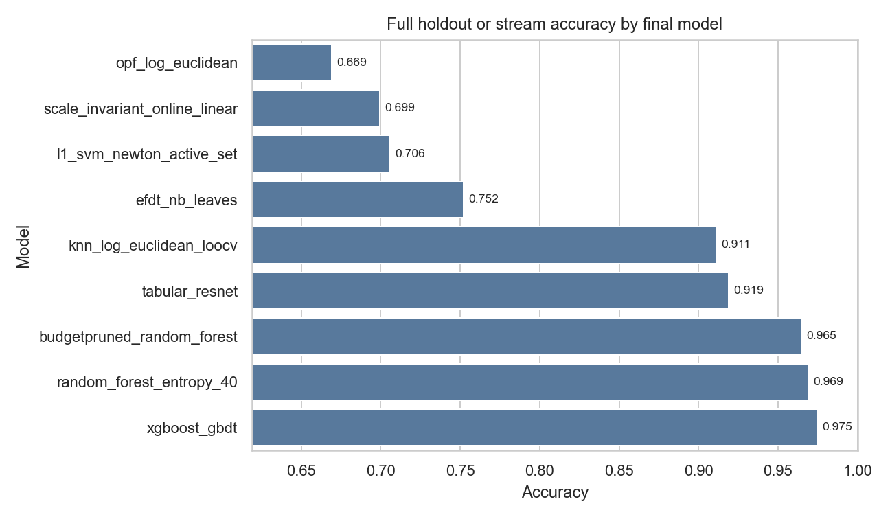
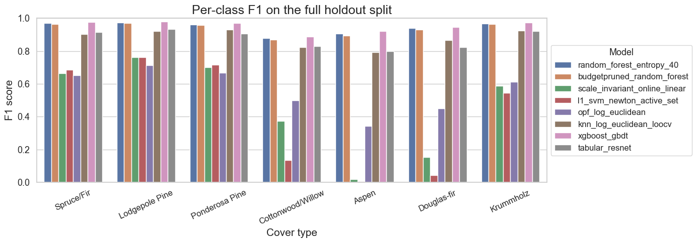

# Forest Covertype Resource-Aware Pipeline

This project adds a reproducible pipeline for the UCI Forest Covertype dataset [^fn1] for multiple machine learning models to find reliables classifiers for forest cover types. The dataset contains 581,012
instances, 54 features, and a mixture of terrain measurements,
wilderness indicators, and sparse soil-type indicators. The seven types used for classification are: Spruce/Fir, Lodgepole Pine, Ponderosa Pine, Cottonwood/Willow, Aspen, Douglas-fir, and Krummholz. 

## Notebooks

- `01_ForestCover_Exploratory_Analysis.ipynb`: full exploratory analysis in the same report style as the original notebook.
- `02_Covertype_Preprocess_Tune_Train_Compare.ipynb`: preprocessing, sample-based feature and hyperparameter selection, full 20 percent holdout training/testing, model persistence, plots, tables, and comparisons.

## Setup

```powershell
.\.venv\Scripts\python.exe -m pip install -r requirements.txt
```

## Train

Full run:

```powershell
.\.venv\Scripts\python.exe train_covertype.py
```

Smoke run:

```powershell
.\.venv\Scripts\python.exe train_covertype.py --limit 3000 --models rf,budgetprune,online,l1svm,opf
```

The script writes trained models immediately after each fit to `models/` and updates `reports/covertype_metrics.json` after each evaluation.

The CLI defaults to `--n-jobs 1` so it works in restricted Windows environments. Increase it, for example `--n-jobs -1`, when running outside that constraint.

## Implemented Methods and Libraries

| Model / artifact | Main library or implementation |
| --- | --- |
| `random_forest_entropy_40.joblib` | `scikit-learn` `RandomForestClassifier` |
| `budgetpruned_random_forest.joblib` | `scikit-learn` random forest plus `scipy.optimize.milp` / `linprog` for BUDGETPRUNE-style feature and tree selection |
| `efdt_nb_leaves.pkl` or `hoeffding_nb_leaves.pkl` | `river.tree.ExtremelyFastDecisionTreeClassifier` when available, otherwise `river.tree.HoeffdingTreeClassifier` |
| `l1_svm_newton_active_set.joblib` | Custom NumPy active-set Newton optimizer using the `scikit-learn` estimator interface and `StandardScaler` |
| `opf_log_euclidean.joblib` | `opfython` `SupervisedOPF` when available; otherwise a custom complete-graph OPF fallback using `scipy` and `scikit-learn` distances |
| `knn_log_euclidean_loocv.joblib` | `scikit-learn` `KNeighborsClassifier` / `NearestNeighbors` with a custom Log-Euclidean transformer |
| `scale_invariant_online_linear.joblib` | Custom NumPy ScInOL-style online softmax classifier using the `scikit-learn` estimator interface |
| XGBoost GBDT notebook model | `xgboost.XGBClassifier` |
| CatBoost GBDT notebook model | `catboost.CatBoostClassifier` |
| Histogram GBDT fallback notebook model | `scikit-learn` `HistGradientBoostingClassifier` |
| Tabular ResNet notebook model | Custom `torch.nn.Module` trained with PyTorch |
| FT-Transformer mini notebook model | Custom `torch.nn.Module` trained with PyTorch |
| NODE-lite notebook model | Custom `torch.nn.Module` trained with PyTorch |
| TabNet notebook model | `pytorch-tabnet` `TabNetClassifier` |

Notes:

- Batch algorithms use an exact 80/20 holdout train-test split.
- Stream evaluation processes rows sequentially in dataset order and records online accuracy plus Cohen's Kappa.
- The OPF fallback is O(n^2); use `--opf-max-train 0` only if an external OPF backend is installed or the machine can hold the full graph.
- Full k-NN leave-one-out over Covertype is exact but computationally expensive.
- Optional first-150,000-row clustering energy benchmark: add `--run-k2means`.

## Results of the selected models over the whole dataset






[^fn1]: Blackard, J. (1998). Covertype [Dataset]. UCI Machine Learning Repository. https://doi.org/10.24432/C50K5N.
